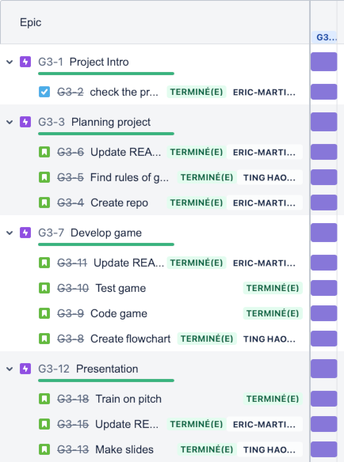

# Battleships game
*Eric Martinet & Ting Hao Kao*

*Data Analytics bootcamp @IronHack Paris, Feb-Apr 22*

## Content
- [Project Description](#project-description)
- [Rules](#rules)
- [Workflow](#workflow)
- [Organization](#organization)
- [Links](#links)

## Project Description
We have build the famous "battleship" game in Python.
This is our first mini-project after a single week of class.

## Rules
Battleship is a 2-player guessing game.
Your goal is to sink all of your opponent's ships by correctly guessing their locations before your opponent sinks all of yours.
Our game follows the classic Milton Bradley's rules.

## Workflow
We:
* planned the project on JIRA
* drew the flowchart of the algorithm
* coded the game with many test & recode iterations
* presented the game to the class

## Organization
JIRA was our tool of choice for planning the project.

SLACK was used for communicating between team members.

Our repo is organised as follows:
* [Code](https://github.com/eric-martinet/Battleships_game/tree/main/Code): Source code in Jupyter notebook and Python formats for convenience
* [Flowchart](https://github.com/eric-martinet/Battleships_game/tree/main/Flowchart): Algorithm's flowchart in drawio and jpg formats
* [Presentation](https://github.com/eric-martinet/Battleships_game/tree/main/Presentation): Powerpoint presentation made to the class

## Links
[Game's repository](https://github.com/eric-martinet/Battleships_game/) 
[Presentation on Google slides](https://docs.google.com/presentation/d/1K_5tFlDcUJk0ru5bCAC2yqigA4j0xnnVPASRhLy8XQM/edit#slide=id.g11743c01ecd_0_0)
For more information on the game: https://en.wikipedia.org/wiki/Battleship_(game).
